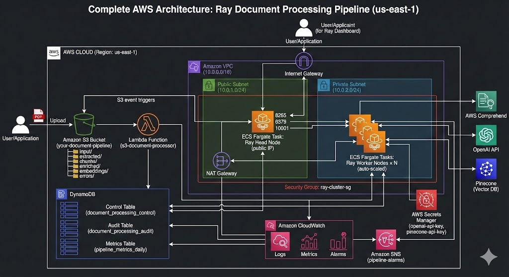

# Complete Architecture Diagram & AWS Cost Analysis
## Ray Document Processing Pipeline - Detailed Component Breakdown


---


The architecture diagram illustrates a document processing pipeline built on AWS, designed to handle document ingestion, processing, and indexing.

1. **Ingestion Layer**: The process begins when a user or application uploads a PDF document to a designated `input/` folder within an **Amazon S3 Bucket**. This upload event triggers a **Lambda Function** (`s3-document-processor`), which generates a unique ID for the document and creates an initial control record in a **DynamoDB Control Table**, marking its status as "PENDING". An audit record is also written to a **DynamoDB Audit Table** to track the event.
2. **Compute Layer**: The core processing is managed by a **Ray Cluster** running on **Amazon ECS Fargate** within an **Amazon VPC**. The cluster consists of a **Ray Head Node** in a public subnet, which orchestrates the workflow and serves the Ray Dashboard. **Ray Worker Nodes**, located in a private subnet, are responsible for executing the processing tasks. The Head Node polls the DynamoDB Control Table for pending documents and assigns them to the worker nodes.
3. **Processing Pipeline**: The worker nodes execute a multi-stage processing pipeline on the documents. This involves:
* **Extraction**: Downloading the PDF from S3, extracting text and images using Docling, and uploading the output back to S3.
* **Chunking**: Segmenting the extracted text into semantic chunks and saving them to S3.
* **Enrichment**: Using the **AWS Comprehend** API to add metadata like entities and sentiment to the chunks, then saving the enriched data to S3.
* **Embedding**: Generating embeddings for the chunks using the **OpenAI API**, with API keys securely retrieved from **AWS Secrets Manager**, and storing the results in S3.
* **Loading**: Loading the generated vectors into a **Pinecone Vector Database** for indexing and retrieval.

4. **State Management and Monitoring**: Throughout the process, the Ray Worker Nodes update the document's status in the DynamoDB Control Table. All components, including Lambda, ECS, and the external APIs, send logs and metrics to **Amazon CloudWatch**. CloudWatch monitors these metrics and can trigger alarms via **Amazon SNS** in case of failures or performance issues. A separate **DynamoDB Metrics Table** is used to store aggregated daily performance and cost metrics for the pipeline. **Amazon ECR** is used to store the Docker images for the Ray nodes, and **IAM Roles** manage the permissions for all services.

---


# S3 Ingestion & Lambda Trigger Flow

## Overview
This diagram focuses specifically on the initial steps that occur when a document is uploaded to AWS.

---

## Process Flow

### 1. User Upload
A **User** uploads a PDF file to the designated `input/` folder within an **S3 Bucket**.

### 2. Event Trigger
The successful upload triggers an **S3 ObjectCreated Event**.

### 3. Lambda Invocation
This event automatically triggers the execution of the Lambda function `s3-document-processor`.

### 4. Lambda Execution Steps
Inside the Lambda function, the following steps occur sequentially:

#### Step 1: Extract Event Details
The function parses the incoming event to get details like the bucket name and object key (filename).

#### Step 2: Generate document_id
A unique identifier is generated for the new document.

#### Step 3: Write Records
The function writes a new control record with a `"PENDING"` status to the **DynamoDB Control Table** and an initial audit trail record to the **DynamoDB Audit Table**.


### 1. Upload & Ingestion
A **User** uploads a PDF document to the `input/` folder of an **S3 Bucket**. This action triggers an **S3 Event**.

### 2. Initial Processing
The **S3 Event** invokes a **Lambda function** named `s3-document-processor`. This Lambda function creates an initial record in the **DynamoDB Control Table** with a status of `"PENDING"`.

### 3. Task Orchestration
A **Ray Head Node** continuously polls the **DynamoDB Control Table**, looking for documents with a `"PENDING"` status.

### 4. Worker Pipeline Execution
Once a pending document is found, the **Ray Head Node** assigns the task to a **Ray Worker Node**. The Worker Node then executes a **five-stage pipeline**:

#### Stage 1: Extraction
The worker runs **Docling** to extract text and images from the PDF, saving the output to the `extracted/` folder in the **S3 Bucket**.

#### Stage 2: Chunking
The extracted text is segmented into smaller chunks, which are saved to the `chunks/` folder in the **S3 Bucket**.

#### Stage 3: Enrichment
The worker calls the **AWS Comprehend API** to enrich the chunks with metadata (e.g., entities, sentiment) and saves the enriched data to the `enriched/` folder in the **S3 Bucket**.

#### Stage 4: Embedding
The worker calls the **OpenAI API** to generate embeddings for the enriched chunks, saving the results to the `embeddings/` folder in the **S3 Bucket**.

#### Stage 5: Loading
Finally, the worker loads the generated embeddings into the **Pinecone vector database** for indexing.

### 5. Completion
Upon successful completion of all stages, the **Ray Worker Node** updates the status of the document in the **DynamoDB Control Table** to `"COMPLETED"`.

---


# Ray Cluster Task Execution Flow

## Overview
This diagram details the internal workings of the Ray cluster and how it manages document processing tasks.

---

## Process Flow

### 1. Polling
The **Ray Head Node**, running as an ECS Task, continuously polls the **DynamoDB Control Table** to find documents that are ready for processing (i.e., status is `"PENDING"`).

### 2. Task Assignment
When a pending document is identified, the **Ray Head Node** assigns the processing task to one of the available **Ray Worker Nodes**, which are also running as ECS Tasks. This assignment can happen in parallel for multiple documents across multiple workers.

### 3. Worker Execution
Each assigned **Ray Worker Node** performs the following actions independently:

- It **reads** the necessary input artifacts (e.g., the source PDF or intermediate outputs) from the **S3 Bucket**.
- It **processes** the data through the various stages of the pipeline (extraction, chunking, etc.).
- It **writes** the generated output artifacts back to different folders in the **S3 Bucket**.
- Throughout the process, it **updates** the status of its assigned task in the **DynamoDB Control Table** to reflect its current progress or completion.

---


# Cost & Monitoring Data Flow

## Overview
This diagram shows how operational data is collected from various sources for the purposes of monitoring, alerting, and cost analysis.

---

## Process Flow

### 1. Data Sources
Several components generate logs and metrics:
- **ECS Fargate (Ray Cluster)** sends logs from the Ray Head and Worker nodes
- **Lambda Function** sends execution logs
- **External APIs** (Comprehend, OpenAI, Pinecone) generate usage metrics
- **S3 & Data Transfer** activities generate usage and access logs

### 2. Data Aggregation
All these logs and metrics are sent to a central **Amazon CloudWatch** service.

### 3. Cost Analysis
Cost-related data from CloudWatch is consumed by **AWS Cost Explorer** to provide insights into the infrastructure and API costs.

### 4. Monitoring & Alerting
The metrics collected in CloudWatch are monitored by **CloudWatch Alarms**. If a pre-defined threshold is breached (e.g., high error rate, long processing time), an alarm triggers a notification to an **Amazon SNS** topic named `pipeline-alarms`, which can then send alerts to administrators.

---

## 💰 Comprehensive AWS Pricing Breakdown

### 1. Amazon S3 Storage Tiers & Pricing

#### S3 Storage Classes (Comparison)

| Storage Class | Use Case | First 50 TB/month | Retrieval Cost | Minimum Storage | Availability |
|--------------|----------|-------------------|----------------|-----------------|--------------|
| **S3 Standard** | Frequently accessed | **$0.023/GB** | None | None | 99.99% |
| **S3 Intelligent-Tiering** | Unknown/changing patterns | $0.023 + $0.0025 monitoring | None | None | 99.9% |
| **S3 Standard-IA** | Infrequent access | **$0.0125/GB** | $0.01/GB | 30 days | 99.9% |
| **S3 One Zone-IA** | Non-critical, infrequent | **$0.01/GB** | $0.01/GB | 30 days | 99.5% |
| **S3 Glacier Instant** | Archive, instant retrieval | **$0.004/GB** | $0.03/GB | 90 days | 99.9% |
| **S3 Glacier Flexible** | Archive, 1-12 hour retrieval | **$0.0036/GB** | $0.01-0.03/GB | 90 days | 99.99% |
| **S3 Glacier Deep Archive** | Long-term archive, 12-48h | **$0.00099/GB** | $0.02-0.03/GB | 180 days | 99.99% |

#### Our Pipeline S3 Lifecycle Strategy

```
Document Lifecycle Journey:

input/ folder:
├── Day 0-30:   S3 Standard ($0.023/GB)           ← Upload, immediate processing
├── Day 31-90:  Intelligent-Tiering ($0.023/GB)   ← Less frequent access
├── Day 91-365: Glacier Flexible ($0.0036/GB)     ← Archive, rarely accessed
└── Day 365+:   DELETED                            ← Removed from S3

extracted/ folder:
├── Day 0-7:    S3 Standard ($0.023/GB)           ← Recent extractions
├── Day 8-30:   Intelligent-Tiering ($0.023/GB)   ← Cooling off
├── Day 31-90:  Glacier Flexible ($0.0036/GB)     ← Archive
└── Day 90+:    DELETED                            ← No longer needed

chunks/ & enriched/ folders:
├── Same as extracted/ (processed artifacts)

embeddings/ folder:
├── Day 0-7:    S3 Standard ($0.023/GB)           ← Active vectors
├── Day 8+:     Intelligent-Tiering ($0.023/GB)   ← Long-term storage
└── Never deleted (kept for reprocessing)

errors/ folder:
├── Day 0-1:    S3 Standard ($0.023/GB)           ← Debug immediately
├── Day 2-7:    Intelligent-Tiering ($0.023/GB)   ← Investigation
├── Day 8-180:  Glacier Flexible ($0.0036/GB)     ← Archive
└── Day 180+:   DELETED                            ← Cleanup
```

#### S3 Cost Example (1,000 Documents/Month)

```
Assumptions:
• Average PDF: 2 MB
• Extracted artifacts: 15 MB per doc
• Chunks JSON: 500 KB per doc
• Enriched JSON: 650 KB per doc
• Embeddings JSON: 2.1 MB per doc

Monthly Storage (after lifecycle transitions):

input/:
• 0-30 days: 1,000 docs × 2 MB × $0.023/GB = $0.05
• 31-90 days: 2,000 docs (2 months) × 2 MB × $0.0036/GB = $0.01
Total: $0.06

extracted/:
• 0-7 days: 250 docs × 15 MB × $0.023/GB = $0.09
• 8-30 days: 750 docs × 15 MB × $0.023/GB = $0.26
• 31-90 days: 2,000 docs × 15 MB × $0.0036/GB = $0.11
Total: $0.46

chunks/ + enriched/:
• Similar to extracted/
Total: ~$0.30

embeddings/:
• All data: 12,000 docs × 2.1 MB × $0.023/GB = $0.58
Total: $0.58

errors/ (assume 2% failure):
• Minimal: ~$0.01

TOTAL S3 STORAGE: ~$1.41/month
```

#### S3 Request Pricing

```
PUT/COPY/POST requests: $0.005 per 1,000 requests
GET/SELECT requests: $0.0004 per 1,000 requests

Monthly (1,000 documents):
• PUT requests: 5,000 (uploads across stages) × $0.005/1,000 = $0.03
• GET requests: 10,000 (downloads) × $0.0004/1,000 = $0.004

TOTAL S3 REQUESTS: $0.034/month
```

#### S3 Data Transfer Pricing

```
Data Transfer OUT from S3 to Internet:
• First 10 TB/month: $0.09/GB
• Next 40 TB/month: $0.085/GB
• Over 50 TB/month: $0.07/GB

Data Transfer IN to S3: FREE
Data Transfer between S3 and EC2 (same region): FREE
Data Transfer between S3 and Lambda (same region): FREE

Monthly (1,000 documents):
• Upload: 2 GB IN = $0 (free)
• Processing: All within region = $0 (free)
• User downloads: 10 GB OUT = 10 × $0.09 = $0.90

TOTAL S3 DATA TRANSFER: $0.90/month
```

### 2. Amazon ECS Fargate Pricing

#### Fargate Pricing (On-Demand vs Spot)

```
ON-DEMAND PRICING:
• vCPU: $0.04048 per vCPU per hour
• Memory: $0.004445 per GB per hour

SPOT PRICING (60% discount):
• vCPU: $0.01243651 per vCPU per hour
• Memory: $0.00136555 per GB per hour

Ray Head (2 vCPU, 8 GB) - 24/7:
• On-Demand: (2 × $0.04048 + 8 × $0.004445) × 730 hours = $85.25/month
• Spot: (2 × $0.01243651 + 8 × $0.00136555) × 730 hours = $26.12/month
• SAVINGS: $59.13/month (69.4%)

Ray Workers (2 × 1 vCPU, 4 GB) - 24/7:
• On-Demand: 2 × (1 × $0.04048 + 4 × $0.004445) × 730 = $84.54/month
• Spot: 2 × (1 × $0.01243651 + 4 × $0.00136555) × 730 = $25.92/month
• SAVINGS: $58.62/month (69.3%)

TOTAL ECS (On-Demand): $169.79/month
TOTAL ECS (Spot): $52.04/month
SAVINGS: $117.75/month (69.3%)
```

#### Auto-Scaling Cost Optimization

```
Scenario: Process 1,000 docs/month (avg 33 docs/day)

With Smart Auto-Scaling:
• Peak hours (9am-5pm, M-F): 5 workers
• Off-peak (nights/weekends): 1 worker

Worker Hours Calculation:
• Peak: 8 hours × 5 days × 4 weeks × 5 workers = 800 worker-hours
• Off-peak: 16 hours × 5 days × 4 weeks × 1 worker = 320 worker-hours
• Weekends: 48 hours × 8 days × 1 worker = 384 worker-hours
• Total: 1,504 worker-hours vs 1,460 (2 workers 24/7)

Cost with Auto-Scaling (Spot):
• Workers: 1,504 × (1 × $0.01243651 + 4 × $0.00136555) = $26.75/month
• vs Fixed 2 workers: $25.92/month

Note: Nearly same cost, but handles peak load better!
```

### 3. Amazon DynamoDB Pricing

#### On-Demand Pricing (What We Use)

```
Read Request Units (RRU):
• $1.25 per million RRUs
• 1 RRU = 4 KB of data read

Write Request Units (WRU):
• $1.25 per million WRUs
• 1 WRU = 1 KB of data written

Storage:
• $0.25 per GB-month

Monthly Cost (1,000 documents):

Control Table:
• Writes: 15,000 (Lambda + 5 stages × 2 updates) × 2 KB = 30,000 WRUs = $0.04
• Reads: 50,000 (polling every 30s + status checks) × 4 KB = 50,000 RRUs = $0.06
• Storage: 0.1 GB × $0.25 = $0.03
Total: $0.13

Audit Table:
• Writes: 10,000 events × 1 KB = 10,000 WRUs = $0.01
• Reads: 1,000 (occasional queries) × 4 KB = 1,000 RRUs = $0.001
• Storage: 0.05 GB × $0.25 = $0.01
Total: $0.02

Metrics Table:
• Writes: 30 (daily updates) × 5 KB = 150 WRUs = $0.0002
• Reads: 100 × 4 KB = 100 RRUs = $0.0001
• Storage: 0.01 GB × $0.25 = $0.003
Total: $0.003

TOTAL DYNAMODB: $0.15/month
```

### 4. AWS Lambda Pricing

```
Requests: $0.20 per 1 million requests
Duration: $0.0000166667 per GB-second

Monthly (1,000 documents):
• Requests: 1,000 × $0.20/1M = $0.0002
• Duration: 1,000 invocations × 256 MB × 2 seconds × $0.0000166667/GB-sec
  = 1,000 × 0.25 GB × 2 × $0.0000166667
  = $0.008

TOTAL LAMBDA: $0.008/month
```

### 5. Amazon VPC Pricing

```
NAT Gateway:
• $0.045 per hour = $32.85/month
• Data processing: $0.045 per GB

Monthly (1,000 documents):
• NAT Gateway: $32.85
• Data processed: 50 GB × $0.045 = $2.25

TOTAL VPC: $35.10/month

OPTIMIZATION TIP:
• Use VPC Endpoints for S3 and DynamoDB = FREE
• Eliminates NAT Gateway traffic for AWS services
• Potential savings: ~$2.25/month in data processing
```

### 6. Amazon ECR Pricing

```
Storage: $0.10 per GB-month

Monthly:
• Docker image: 2 GB × $0.10 = $0.20
• 10 image versions: ~$2.00

TOTAL ECR: $2.00/month
```

### 7. CloudWatch Pricing

```
Logs Ingestion: $0.50 per GB
Logs Storage: $0.03 per GB-month
Metrics: $0.30 per custom metric per month
Alarms: $0.10 per alarm per month

Monthly (1,000 documents):
• Logs ingestion: 10 GB × $0.50 = $5.00
• Logs storage (7-day retention): 2 GB avg × $0.03 = $0.06
• Custom metrics: 10 metrics × $0.30 = $3.00
• Alarms: 5 alarms × $0.10 = $0.50

TOTAL CLOUDWATCH: $8.56/month
```

### 8. External Services Pricing

#### AWS Comprehend

```
Pricing: $0.0001 per unit (1 unit = 100 characters)

Monthly (1,000 documents × 234 chunks × 1,500 chars avg):
• Characters: 351 million
• Units: 3.51 million
• Cost: 3.51M × $0.0001 = $351

TOTAL COMPREHEND: $351/month

OPTIMIZATION:
• Cache results for repeated content
• Process only new content
• Batch API calls efficiently
```

#### OpenAI API

```
text-embedding-3-small:
• $0.020 per 1 million tokens

Monthly (1,000 documents × 234 chunks × 300 tokens avg):
• Tokens: 70.2 million
• Cost: 70.2M × $0.020/1M = $1.40

TOTAL OPENAI: $1.40/month
```

#### Pinecone

```
Starter Plan: $70/month
• 100,000 vectors
• 1 pod (s1 size)
• Includes all operations (upsert, query, delete)

For 234,000 vectors (1,000 documents):
• Need: Standard plan with 2-3 pods
• Cost: 3 pods × $0.096/hour × 730 hours = $210.24/month

OR use Serverless (new):
• $0.30 per million read units
• $2.00 per million write units
• Storage: $0.25 per GB-month

Serverless (better for variable load):
• Writes: 234K × $2.00/1M = $0.47
• Reads: 100K queries × $0.30/1M = $0.03
• Storage: 1 GB × $0.25 = $0.25

TOTAL PINECONE (Serverless): $0.75/month
```

---

## 📊 TOTAL MONTHLY COST SUMMARY

### Infrastructure (24/7 Operation)

```
┌─────────────────────────────────────────────────────────────┐
│                    INFRASTRUCTURE COSTS                      │
├──────────────────────────────────┬────────────┬─────────────┤
│ Component                        │ On-Demand  │ Spot/Optim  │
├──────────────────────────────────┼────────────┼─────────────┤
│ ECS Fargate (Ray Cluster)        │   $169.79  │    $52.04   │
│ NAT Gateway + VPC                │    $35.10  │    $35.10   │
│ S3 Storage + Requests            │     $2.35  │     $2.35   │
│ DynamoDB (On-Demand)             │     $0.15  │     $0.15   │
│ Lambda                           │     $0.01  │     $0.01   │
│ ECR                              │     $2.00  │     $2.00   │
│ CloudWatch                       │     $8.56  │     $8.56   │
├──────────────────────────────────┼────────────┼─────────────┤
│ SUBTOTAL (Infrastructure)        │  $217.96   │   $100.21   │
└──────────────────────────────────┴────────────┴─────────────┘
```

### Per-Document Processing (Variable Costs)

```
┌──────────────────────────────────────────────────────────────┐
│              PER 1,000 DOCUMENTS PROCESSED                    │
├──────────────────────────────────┬──────────────────────────┤
│ Service                          │ Cost                     │
├──────────────────────────────────┼──────────────────────────┤
│ AWS Comprehend (NLP)             │  $351.00                 │
│ OpenAI Embeddings                │    $1.40                 │
│ Pinecone (Serverless)            │    $0.75                 │
│ S3 Data Transfer (downloads)     │    $0.90                 │
│ ECS Auto-Scaling (processing)    │    $2.00                 │
├──────────────────────────────────┼──────────────────────────┤
│ SUBTOTAL (per 1K docs)           │  $356.05                 │
│ Per document                     │   $0.36                  │
└──────────────────────────────────┴──────────────────────────┘
```

### TOTAL COST SCENARIOS

```
┌───────────────────────────────────────────────────────────────────────┐
│                      MONTHLY COST SCENARIOS                            │
├─────────────────────────┬──────────────┬──────────────┬──────────────┤
│ Scenario                │ Docs/Month   │ On-Demand    │ Spot/Optim   │
├─────────────────────────┼──────────────┼──────────────┼──────────────┤
│ Light (100 docs)        │     100      │   $253.57    │   $135.82    │
│ Medium (1,000 docs)     │   1,000      │   $574.01    │   $456.26    │
│ Heavy (10,000 docs)     │  10,000      │ $3,778.46    │ $3,660.71    │
│ Enterprise (100K docs)  │ 100,000      │$35,822.96    │$35,705.21    │
├─────────────────────────┴──────────────┴──────────────┴──────────────┤
│ Breakdown:                                                             │
│ • Infrastructure: Fixed monthly cost (varies on-demand vs spot)       │
│ • Processing: $0.36 per document (variable)                           │
│ • Optimization: Use Spot instances + VPC endpoints + caching          │
└───────────────────────────────────────────────────────────────────────┘
```

---

## 🎯 Cost Optimization Strategies

### 1. Use Fargate Spot (Save 69%)

```bash
# Update ECS service to use Spot capacity providers
aws ecs put-cluster-capacity-providers \
  --cluster ray-document-pipeline \
  --capacity-providers FARGATE_SPOT FARGATE \
  --default-capacity-provider-strategy \
    capacityProvider=FARGATE_SPOT,weight=4 \
    capacityProvider=FARGATE,weight=1

# Savings: $117.75/month on infrastructure
```

### 2. Use VPC Endpoints (Save NAT costs)

```python
# Create VPC endpoints for S3 and DynamoDB
# Eliminates NAT Gateway data processing charges
# Savings: ~$2.25/month on data transfer
```

### 3. Implement Caching (Save Comprehend costs)

```python
# Cache Comprehend results for repeated content
# Hash chunk content, store in DynamoDB
# Savings: 50-80% on Comprehend costs = ~$175/month
```

### 4. Stop Cluster When Idle

```bash
# Scale down to 0 workers during non-business hours
# Stop Ray head on weekends
# Savings: ~$50/month on compute
```

### 5. Use S3 Intelligent-Tiering

```bash
# Automatically transitions objects to cheaper tiers
# No retrieval fees (unlike Glacier)
# Savings: Variable based on access patterns
```

---

## 📈 Scalability & Performance

### Throughput Capacity

```
Single Ray Worker (1 vCPU, 4 GB):
• Extraction: 5-10 PDFs/hour (depends on size)
• Chunking: 20-30 documents/hour
• Enrichment: 10-15 documents/hour
• Embedding: 5-10 documents/hour
• Loading: 20-30 documents/hour

With 10 Ray Workers (Auto-Scaled):
• Peak throughput: 50-100 PDFs/hour
• Daily capacity: 1,200-2,400 documents
• Monthly capacity: 36,000-72,000 documents
```

### Latency (Per Document)

```
Average Processing Time:
• Extraction: 90 seconds (45 pages)
• Chunking: 25 seconds
• Enrichment: 85 seconds (AWS Comprehend)
• Embedding: 145 seconds (OpenAI API)
• Loading: 35 seconds (Pinecone)

Total: ~380 seconds (6.3 minutes) per document

With Parallel Processing (10 workers):
• 10 documents processed simultaneously
• Effective throughput: ~95 documents/hour
```

---

**Author:** Prudhvi @ Thoughtworks  
**Date:** February 2025  
**Version:** 1.0
